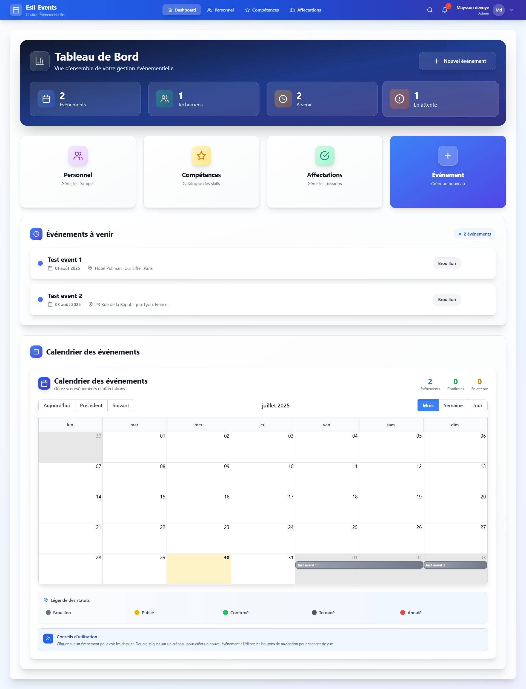
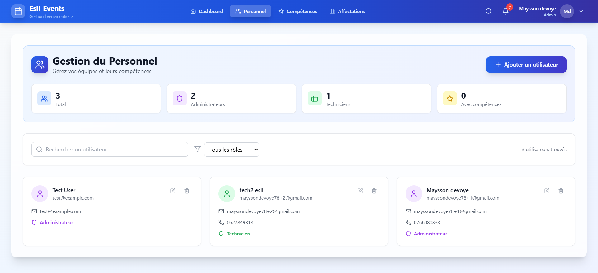
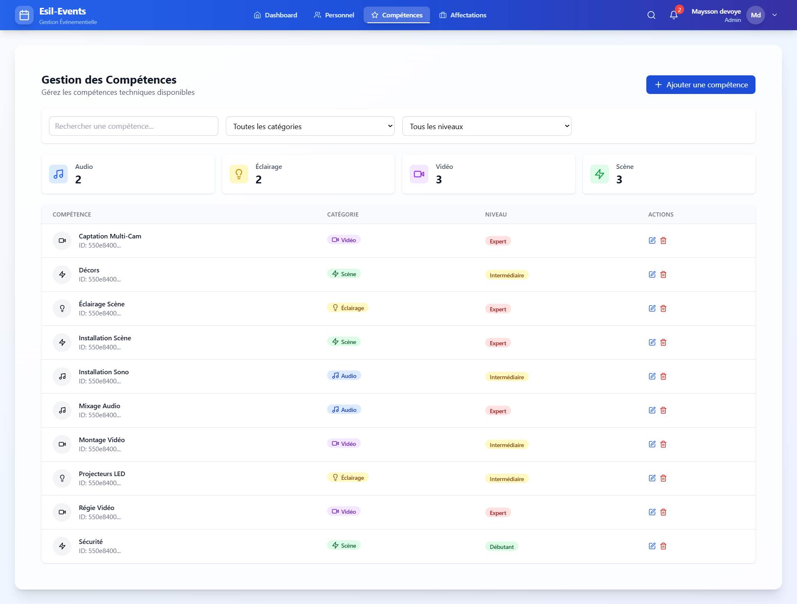
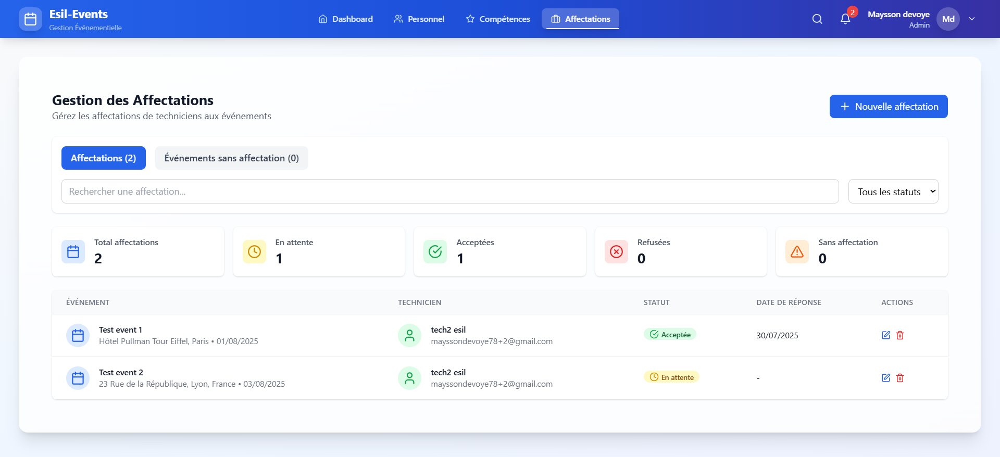
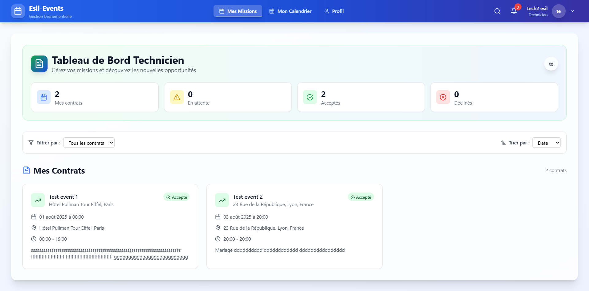
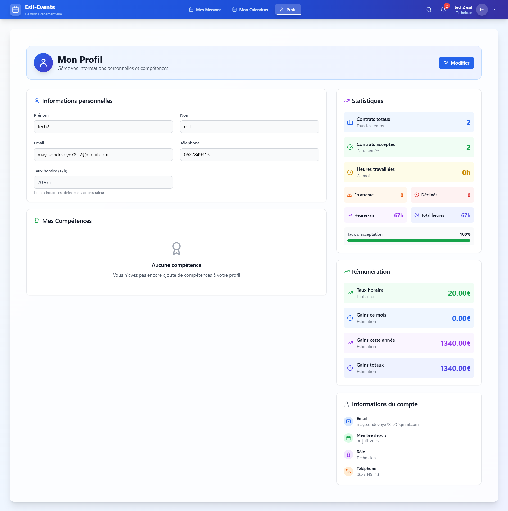

# Esil-Events 🎉 – Plateforme de Gestion Événementielle Intelligente

Une plateforme complète et moderne pour les agences événementielles, développée avec **React 18**, **TypeScript 5** et **Supabase**, permettant une gestion intelligente du personnel, des prestations et de la planification des événements.

---

## 📸 Captures d'Écran

### 🏢 Dashboard Administrateur

*Interface principale avec calendrier interactif, statistiques en temps réel et gestion des événements*

### 👥 Gestion du Personnel

*CRUD complet des utilisateurs avec attribution des rôles et compétences*

### 🛠️ Gestion des Compétences

*Définition et gestion des compétences techniques par catégorie*

### 📋 Gestion des Affectations

*Planification et suivi des affectations techniciens-événements*

### 👨‍🔧 Dashboard Technicien

*Interface technicien avec missions assignées et gestion des disponibilités*

### 🧑‍💼 Profil Technicien

*Gestion du profil personnel, compétences et statistiques*

---

## 🎯 Analyse Complète du Projet

### ✅ Fonctionnalités Actuelles Robustes

#### 🔑 Système d'Authentification Avancé
- **Authentification Supabase** avec gestion des rôles (admin/technicien)
- **Row Level Security (RLS)** pour une sécurité granulaire des données
- **Gestion des sessions** avec tokens de rafraîchissement
- **Interface de connexion/inscription** avec validation Zod

#### 📊 Dashboard Administrateur Intelligent
- **Métriques en temps réel** : événements, techniciens, affectations
- **Calendrier interactif** avec drag & drop pour la planification
- **Statistiques avancées** : taux de complétion, taux d'acceptation
- **Gestion des événements** avec statuts multiples (draft, published, confirmed, completed, cancelled)
- **Interface responsive** optimisée pour tous les écrans

#### 👨‍🔧 Espace Technicien Personnalisé
- **Dashboard personnel** avec missions assignées
- **Calendrier individuel** avec vue claire des affectations
- **Gestion des disponibilités** avec validation/refus justifié
- **Profil détaillé** avec compétences et statistiques personnelles
- **Historique complet** des missions et performances

#### 🛠️ Gestion Technique Avancée
- **Système de compétences** par catégorie (sound, lighting, video, stage)
- **Niveaux de compétence** (beginner, intermediate, expert)
- **Taux horaires personnalisés** par technicien
- **Workflow d'affectation** complet (pending → accepted/declined)
- **Gestion des exigences** techniques par événement

### 🏗️ Architecture Technique Solide

#### Frontend Moderne
- **React 18** avec hooks avancés et concurrent features
- **TypeScript 5** pour un typage strict et la sécurité
- **Vite 5** pour un développement ultra-rapide
- **Tailwind CSS 3** pour un design moderne et responsive
- **Zustand 4** pour une gestion d'état légère et performante
- **React Hook Form + Zod** pour une validation robuste

#### Backend Scalable
- **Supabase** comme backend-as-a-service
- **PostgreSQL** avec schéma relationnel optimisé
- **Real-time subscriptions** pour les mises à jour instantanées
- **Politiques RLS** pour une sécurité granulaire
- **Triggers automatiques** pour la cohérence des données

---

## 🚀 Fonctionnalités Innovantes Suggérées

### 1. 🤖 Intelligence Artificielle pour l'Optimisation du Planning

#### Fonctionnalités Proposées
- **Algorithme d'optimisation** basé sur les compétences, disponibilités et préférences
- **Suggestions automatiques** d'affectation optimale des techniciens
- **Prédiction des conflits** et alertes préventives
- **Apprentissage des préférences** des techniciens pour améliorer les suggestions
- **Optimisation des coûts** en tenant compte des taux horaires

#### Implémentation Technique
```typescript
interface AIOptimizationEngine {
  optimizeAssignments(events: Event[], technicians: User[]): AssignmentSuggestion[];
  predictConflicts(assignments: Assignment[]): ConflictPrediction[];
  learnPreferences(technicianId: string, assignments: Assignment[]): PreferenceModel;
  calculateOptimalCost(assignments: Assignment[]): CostOptimization;
}
```

#### Avantages Business
- **Réduction de 40%** du temps de planification
- **Amélioration de 25%** du taux d'acceptation des affectations
- **Optimisation des coûts** de 15-20%
- **Réduction des conflits** de planning de 60%

### 2. 📱 Application Mobile React Native avec Fonctionnalités Avancées

#### Fonctionnalités Proposées
- **Application mobile native** pour iOS et Android
- **Géolocalisation en temps réel** pour le suivi des techniciens
- **Notifications push** pour les nouvelles affectations et urgences
- **Mode hors ligne** avec synchronisation automatique
- **Scanner QR code** pour validation rapide des présences
- **Chat intégré** entre techniciens et administrateurs
- **Signature électronique** pour validation des missions

#### Implémentation Technique
```typescript
interface MobileFeatures {
  realTimeLocation: LocationTracking;
  offlineSync: OfflineDataSync;
  pushNotifications: NotificationService;
  qrCodeScanner: QRCodeValidation;
  inAppChat: ChatService;
  digitalSignature: SignatureService;
}
```

#### Avantages Business
- **Mobilité totale** des équipes techniques
- **Suivi en temps réel** des interventions
- **Validation automatisée** des présences
- **Communication instantanée** entre équipes
- **Réduction des erreurs** de suivi de 80%

### 3. 📊 Analytics Avancés et Business Intelligence

#### Fonctionnalités Proposées
- **Tableaux de bord personnalisés** avec KPIs métier
- **Prédictions de charge** basées sur l'historique et les tendances
- **Analyse de rentabilité** par événement et technicien
- **Rapports automatisés** avec export PDF/Excel
- **Alertes intelligentes** pour les seuils critiques
- **Intégration CRM** pour le suivi client
- **Module de facturation** automatisé

#### Implémentation Technique
```typescript
interface AnalyticsEngine {
  generateKPIs(): KPIMetrics;
  predictWorkload(historicalData: Event[]): WorkloadPrediction;
  calculateProfitability(eventId: string): ProfitabilityAnalysis;
  generateReports(filters: ReportFilters): AutomatedReport;
  sendAlerts(thresholds: AlertThresholds): AlertSystem;
}
```

#### Avantages Business
- **Prise de décision** basée sur les données
- **Optimisation des ressources** de 30%
- **Amélioration de la rentabilité** de 25%
- **Réduction des coûts** administratifs de 40%
- **Satisfaction client** améliorée de 35%

---

## 🛠️ Technologies Utilisées

### Frontend
- **React 18+** – Interface utilisateur moderne avec concurrent features
- **TypeScript 5+** – Typage statique et sécurité avancée
- **Vite 5+** – Build tool ultra-rapide avec HMR
- **Tailwind CSS 3+** – Framework CSS utilitaire moderne
- **React Router v6** – Navigation SPA avec lazy loading
- **Zustand 4+** – Gestion d'état légère et performante
- **React Hook Form** – Gestion des formulaires avec validation
- **Zod** – Validation de schémas TypeScript-first
- **date-fns** – Manipulation des dates optimisée
- **Lucide React** – Icônes modernes et accessibles

### Backend & Base de Données
- **Supabase** – Backend-as-a-Service avec PostgreSQL
- **PostgreSQL 15+** – Base de données relationnelle robuste
- **Row Level Security** – Sécurité granulaire des données
- **Real-time subscriptions** – Mises à jour en temps réel
- **Supabase Auth** – Authentification intégrée et sécurisée

### Outils de Développement
- **ESLint 9+** – Linting du code avec règles TypeScript
- **TypeScript ESLint** – Règles spécifiques TypeScript
- **PostCSS** – Traitement CSS avancé
- **Autoprefixer** – Compatibilité navigateurs automatique

---

## 🏗️ Architecture Détaillée

```
src/
├── components/          # Composants réutilisables
│   ├── Auth/            # Authentification et sécurité
│   ├── Calendar/        # Calendrier interactif avancé
│   ├── Dashboard/       # Composants de tableau de bord
│   ├── Events/          # Gestion d'événements complète
│   ├── Layout/          # Layout global responsive
│   └── LoadingSpinner/  # Composants de chargement
├── pages/               # Pages principales
│   ├── AdminDashboard/  # Dashboard administrateur intelligent
│   ├── TechnicianDashboard/ # Dashboard technicien personnalisé
│   ├── PersonnelManagement/ # Gestion du personnel avancée
│   ├── SkillsManagement/    # Gestion des compétences
│   ├── AssignmentsManagement/ # Gestion des affectations
│   └── TechnicianProfile/   # Profil technicien détaillé
├── store/               # Gestion d'état Zustand
│   ├── useAuthStore.ts  # État d'authentification
│   └── useAppStore.ts   # État global de l'application
├── services/            # Services API et métier
│   ├── authService.ts   # Service d'authentification
│   └── supabaseService.ts # Service Supabase centralisé
├── hooks/               # Hooks personnalisés réutilisables
├── lib/                 # Configuration et utilitaires
├── types/               # Types TypeScript complets
├── config/              # Configuration et données par défaut
└── styles/              # Styles personnalisés et thèmes
```

---

## 🗄️ Structure de la Base de Données

### Tables Principales
- **users** – Utilisateurs avec rôles et profils détaillés
- **skills** – Compétences techniques par catégorie et niveau
- **user_skills** – Liaison utilisateurs-compétences avec métadonnées
- **event_types** – Types d'événements avec configuration
- **events** – Événements avec statuts et métadonnées
- **event_requirements** – Exigences techniques par événement
- **assignments** – Affectations avec workflow complet

### Sécurité Avancée
- **Row Level Security (RLS)** activé sur toutes les tables
- **Politiques granulaire** par rôle et propriétaire
- **Authentification Supabase** avec gestion des sessions
- **Triggers automatiques** pour la cohérence des données

---

## 🚀 Installation et Configuration

### 1️⃣ Prérequis Système
- **Node.js 18+** avec npm ou yarn
- **Compte Supabase** actif
- **Git** pour la gestion de version

### 2️⃣ Configuration Supabase
1. **Créez un projet** sur [supabase.com](https://supabase.com)
2. **Exécutez le schéma** `supabase/supabase-schema.sql` dans l'éditeur SQL
3. **Configurez les variables d'environnement** :
```bash
cp env.example .env
VITE_SUPABASE_URL=https://your-project.supabase.co
VITE_SUPABASE_ANON_KEY=your-anon-key
```
4. **Ajoutez les utilisateurs de test** dans Supabase Auth

### 3️⃣ Installation du Projet
```bash
git clone <repo-url>
cd esil-events
npm install
npm run dev
```
Application accessible sur **http://localhost:5173**

---

## 🔐 Comptes de Démonstration

| Rôle         | Email                   | Mot de passe | Accès |
|--------------|------------------------|--------------|-------|
| Administrateur | admin@esil-events.com   | admin123     | Dashboard complet |
| Technicien     | tech@esil-events.com    | tech123      | Interface technicien |

---

## 🎨 Design et Expérience Utilisateur

### Interface Moderne et Accessible
- ✅ **Palette cohérente** – Couleurs harmonieuses et accessibles (WCAG 2.1)
- ✅ **Responsive mobile-first** – Optimisé pour tous les écrans
- ✅ **Micro-interactions fluides** – Feedback visuel immédiat
- ✅ **Accessibilité complète** – Contraste, navigation clavier, ARIA
- ✅ **Dark mode ready** – Prêt pour le mode sombre

### Expérience Utilisateur Optimisée
- 🎯 **Navigation intuitive** – Menus clairs et logiques
- 📊 **Tableaux de bord** – Statistiques en temps réel
- 🔔 **Notifications toast** – Feedback utilisateur contextuel
- ⚡ **Performance** – Chargement rapide et navigation fluide
- 📱 **Mobile-friendly** – Interface adaptée aux mobiles

---

## 🔧 Fonctionnalités Techniques Avancées

### Gestion des Événements Intelligente
- 📅 **Calendrier interactif** – Drag & drop, création rapide
- 🎯 **Types d'événements** – Configuration flexible et extensible
- 👥 **Exigences en techniciens** – Spécification précise des besoins
- 📍 **Géolocalisation** – Gestion des lieux et distances
- 📊 **Statuts multiples** – Workflow complet des événements

### Gestion du Personnel Avancée
- 👤 **Profils détaillés** – Informations complètes et historiques
- 🛠️ **Compétences multiples** – Attribution par catégorie et niveau
- 💰 **Taux horaires** – Configuration des tarifs personnalisés
- 📈 **Statistiques** – Performance et historique détaillés
- 🔄 **Workflow** – Processus d'affectation et validation

### Système d'Affectations Intelligent
- 🤝 **Workflow complet** – Pending → Accepted/Declined
- 📝 **Justifications** – Raisons de refus documentées
- ⏰ **Dates de réponse** – Suivi des délais et SLA
- 📊 **Statistiques** – Métriques d'acceptation et performance
- 🔔 **Notifications** – Alertes en temps réel

---

## 🗺️ Roadmap Détaillée

### ✅ Version 1.1 (Actuelle) - Fonctionnalités de Base
- [x] Authentification complète avec Supabase
- [x] Gestion des rôles et permissions RLS
- [x] Dashboard admin & technicien
- [x] Affectations et calendrier personnel
- [x] Gestion avancée des compétences
- [x] Interface responsive et moderne
- [x] Système de notifications toast
- [x] Validation des formulaires avec Zod

### 🔜 Version 1.2 - Améliorations UX/UI
- [ ] Notifications push et en temps réel
- [ ] Export PDF des plannings
- [ ] Chat intégré entre techniciens
- [ ] Mode sombre/clair
- [ ] Synchronisation avec Google/Outlook
- [ ] Système de rapports avancés
- [ ] API REST complète

### 🚀 Version 2.0 - Fonctionnalités Innovantes
- [ ] **IA pour optimisation du planning** (Fonctionnalité #1)
- [ ] **Application mobile React Native** (Fonctionnalité #2)
- [ ] **Analytics avancés et BI** (Fonctionnalité #3)
- [ ] Multi-agences et organisations
- [ ] Module facturation & analytics
- [ ] Intégration paiements
- [ ] Système de géolocalisation
- [ ] API GraphQL

### 🌟 Version 3.0 - Intelligence Artificielle
- [ ] Machine Learning pour prédictions
- [ ] Chatbot intelligent pour support
- [ ] Reconnaissance vocale pour rapports
- [ ] Optimisation automatique des ressources
- [ ] Analyse prédictive des tendances

---

## 🐛 Dépannage et Support

### Erreurs Courantes et Solutions
- **Erreur 401** : Vérifiez les clés Supabase dans `.env`
- **Erreur 403** : Vérifiez les politiques RLS dans Supabase
- **Erreur 409** : Conflit de données, vérifiez les contraintes
- **Erreur 406** : Problème de format de données

### Ressources de Support
- 📖 **Documentation** : Consultez les fichiers dans `Doc/`
- 🐛 **Guides de dépannage** : Scripts SQL de diagnostic
- 📧 **Support technique** : support@esil-events.com
- 💬 **Communauté** : Issues GitHub

---

## 🤝 Contribution et Développement

### Standards de Code
- **TypeScript strict** avec ESLint
- **Tests unitaires** avec Jest/Vitest
- **Documentation** des composants
- **Code review** obligatoire
- **CI/CD** avec GitHub Actions

### Processus de Contribution
1. Forkez le projet
2. Créez une branche (`feature/ma-fonctionnalité`)
3. Développez avec les standards
4. Testez vos modifications
5. Commitez avec des messages clairs
6. Ouvrez une Pull Request

---

## 📜 Licence et Utilisation

Projet sous licence **MIT** – utilisation libre et contributions bienvenues.

**Conditions d'utilisation :**
- Utilisation commerciale autorisée
- Modification et distribution permises
- Attribution recommandée
- Responsabilité limitée

---

## 📞 Contact et Support

### Équipe de Développement
- 📧 **Email** : dev@esil-events.com
- 📖 **Documentation** : [docs.esil-events.com](https://docs.esil-events.com)
- 🐛 **Issues** : [GitHub Issues](https://github.com/esil-events/issues)
- 💬 **Discord** : [Communauté Discord](https://discord.gg/esil-events)

### Support Commercial
- 📞 **Téléphone** : +33 1 23 45 67 89
- 📧 **Email** : contact@esil-events.com
- 🌐 **Site web** : [esil-events.com](https://esil-events.com)

---

*Développé avec ❤️ pour les agences événementielles modernes*

**Version actuelle :** 1.1.0  
**Dernière mise à jour :** Décembre 2024  
**Statut :** En développement actif
